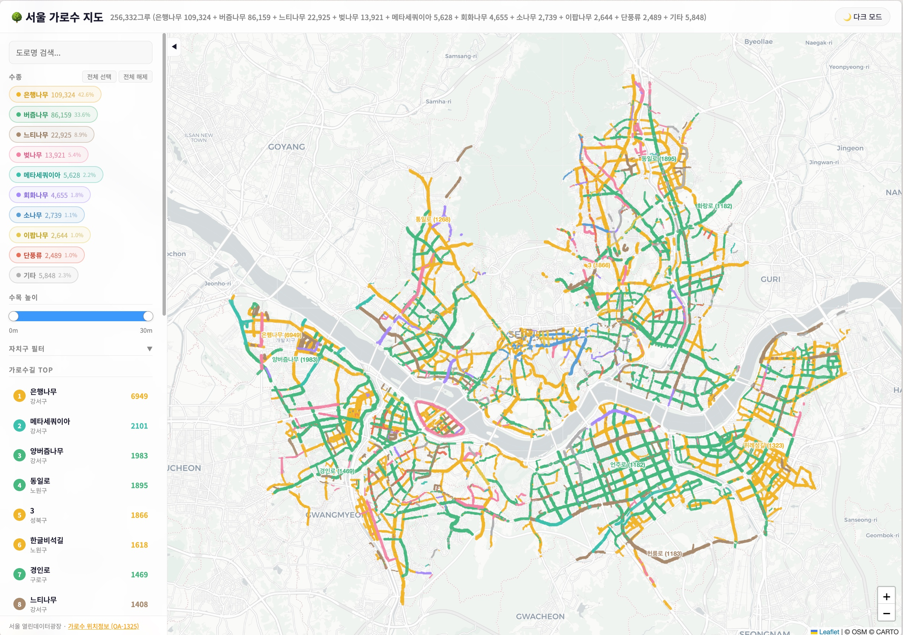

# 서울 가로수 지도

서울시 가로수 257,000그루의 위치를 수종별로 시각화한 인터랙티브 지도.

**[지도 보기 →](https://taekie.github.io/seoul-tree-map/)**

## 수종

| 수종 | 수량 | 비율 |
|------|-----:|-----:|
| 은행나무 | 109,324 | 42.6% |
| 버즘나무 (플라타너스) | 86,159 | 33.6% |
| 느티나무 | 22,925 | 8.9% |
| 벚나무 | 13,921 | 5.4% |
| 메타세쿼이아 | 5,628 | 2.2% |
| 회화나무 | 4,655 | 1.8% |
| 소나무 | 2,739 | 1.1% |
| 이팝나무 | 2,644 | 1.0% |
| 단풍류 | 2,489 | 1.0% |
| 기타 (107종) | 5,848 | 2.3% |

## 기능

- 수종별 필터링 (pill 토글)
- 수목 높이 범위 슬라이더
- 자치구 필터
- 도로명 검색
- 줌아웃: 도로를 따라 선으로 표시 / 줌인: 개별 나무 마커
- 다크 모드

## 데이터

- [서울 열린데이터광장 — 가로수 위치정보 (OA-1325)](https://data.seoul.go.kr/dataList/OA-1325/S/1/datasetView.do)

## 기술

- Leaflet.js + CARTO 타일
- 점→선 변환: DBSCAN 공간 클러스터링 + Nearest-Neighbor chain
